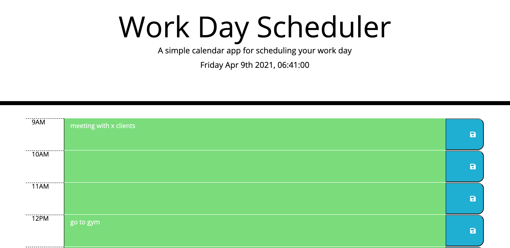

# Work Day Scheduler

## Description

Created a calendar application that allows user to save events for each hour of the day. This app will run in the browser and feature dynamically updated HTML and CSS powered by jQuery.

## What We Did

- Used moment.js for date and time
- Created time block for standard business hours in html.
- Each block includes a time, textarea and button element. 
- Each time block is color coded to indicate whether it is in the past, present, or future.
- Designed the code such that each time block will dynamically change as per the displayed time on the app. 
- Upon entering the event and clicking on save button for a specific time block the text for that event is saved in local storage.
- Upon refreshing the page the saved events persist. 

## Link To Deployed Application 

https://nrasool21.github.io/work-day-scheduler/

## Screenshots

